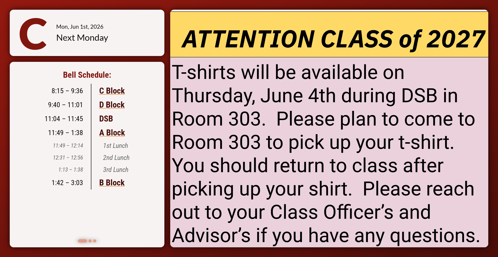
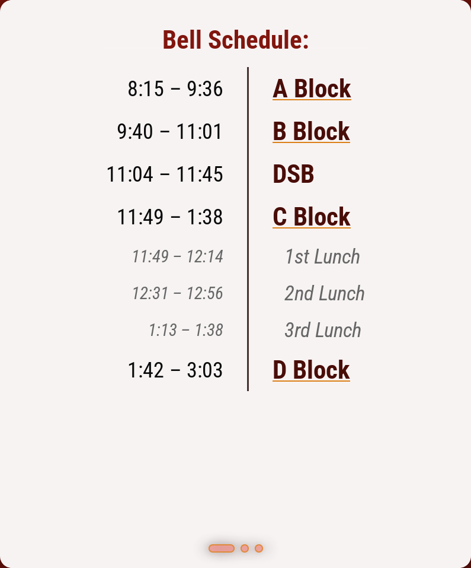
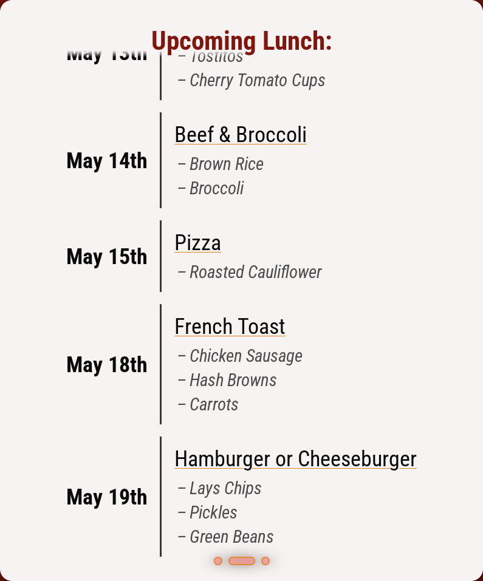
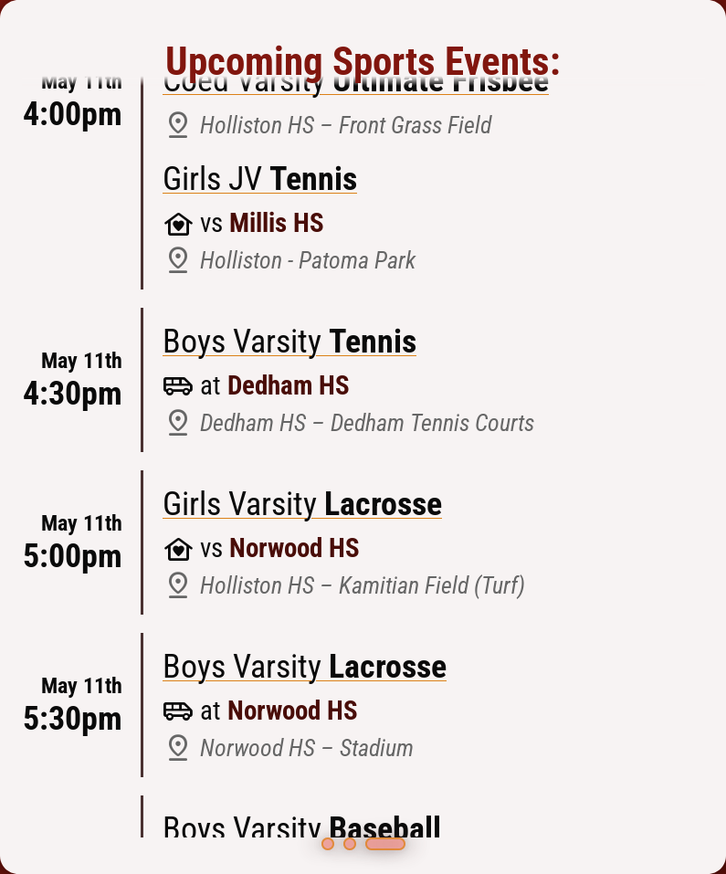

# HHS Digital Signage

Source code for signage such as the TV in the lobby. Written by Holliston High School student Minh Le ('26).

This page shows general information about the app interface. For maintenance information, see [SYSADMIN.md](documentation/SYSADMIN.md#maintenance).

## Google Calendar API

First, a quick note about the Google Calendar API.

The app needs an API key, which can be set in the configuration as `gapikey`. There are multiple methods; for example, set it in `localStorage` or include it as a query parameter. [See below](#configuration) for more details on configuration.

```
DevTools > Storage > Local Storage > (hosted domain)
----------------------------------------------------
Key: gapikey
Value: XXXXX
```
```
DevTools > Console
------------------
> __EXPORT_CONFIG({ gapikey: 'XXXXX' })
##########

[https://<address>/?config=##########]
```

### Expected Data Format

The app fetches data from several calendars and formats them nicely, but in order to do so it makes some assumptions about the original format of the data.

See [SYSADMIN.md](documentation/SYSADMIN.md#data-guidelines) for specific guidelines.

## Widgets



### Day Info **<code>&#x25f0;</code>**

- Shows when the next school day is and what letter day it is
	- Rolls over to the next school day at `dayRolloverTime`
- Big letter showing what period is first
- Absolute and relative formatting of the date

### Carousel **<code>&#x25f1;</code>**

Shows the following widgets in a cycle, scrolling horizontally at an interval. The widgets automatically scroll vertically if they are too tall to fit.

#### 1. Bell Schedule



- Shows the day's schedule with period start/end times
- Shows a message on the last school day before a break
	- e.g. on Friday or the day before a holiday

#### 2. Upcoming Lunch



- Shows upcoming lunch menus and what day they will be served
- Specials, sides, vegetarian indicator

#### 3. Upcoming Sports Events



- Shows upcoming sports games with date/time, teams, and location
- Indicates opponent school, if applicable, and whether it's a home game

### Slideshow **<code>&#x25e8;</code>**

- An embedded Google Slides that cycles through slides at an interval
- Not technically a widget (the following controls may not apply)

## Controls

| Binding                                  | Action |
| ---------------------------------------- | ------ |
| <kbd>&#x1f5b0; L</kbd>                   | Reload widget |
| <kbd>&#x1f5b0; R</kbd>                   | Advance to next widget (carousel) |
| <kbd>Ctrl</kbd> + <kbd>&#x1f5b0; R</kbd> | Pause carousel (manually advance to resume) |

## Configuration

Set these options in LocalStorage as specified, or remove them completely for the default behavior. You may need to reload a widget or the whole page for changes to take effect.

See [`localStorageDefaults` in the code](src/data/config.ts#L9) for the default values.

To support environments where LocalStorage is unavailable, the app also accepts configuration as base64-encoded JSON in the `config` query parameter. For convenience, a helper function is exposed in the DevTools console to export a configuration object in this format:

```js
> __EXPORT_CONFIG({
  	key: value,
  	// ...
  })
##########
```

This will take configuration you typed and merge it on top of the currently running configuration. The printed output may then be passed as the value of `config` in the URL.

```
https://<address>/?config=##########
```

Configurations are applied in the following order (higher is more important):

1. The URL (`?config=##########`)
2. LocalStorage
3. Defaults in the code

### Recognized Configuration Parameters

| Parameter                  | Type            | Description |
| -------------------------- | --------------- | ----------- |
| `dayRolloverTime`          | number 0-24     | Hour of day when the calendar-based widgets should start fetching the next day's information. |
| `disableHtmlSchedule`      | Boolean-like    | Forces HTML bell schedules to render as sanitized plain text when set to something truthy, i.e. `1`. |
| `disableWidgets`           | integer array   | Removes the specified widgets (zero-indexed) from the carousel. For example, `[0, 2]` will hide the first and third widgets. |
| `bellScheduleSize`         | number          | Font size multiplier for the bell schedule widget. |
| `lunchListMax`             | integer         | Maximum number of daily menus to show in the lunch widget. |
| `athleticsListMax`         | integer         | Maximum number of athletics events to show in the athletics widget. |
| `calendarScrollSpeed`      | number >0       | Average pixels per second to scroll if a widget with a list overflows. Scroll speed may momentarily exceed this value to compensate for time spent on easing. Only applies when the list is long enough to scroll. |
| `calendarScrollPause`      | number ≥0       | Milliseconds to pause between the widget lists' scrolling. Only applies when the list is long enough to scroll. |
| `carouselAdvanceInterval`  | number >0       | Milliseconds it takes before the carousel advances to the next widget. |
| `carouselRefreshInterval`  | number >0       | Milliseconds between reloads of each carousel widget. |
| `slideshowAdvanceInterval` | number >0       | Milliseconds it takes before the slideshow advances to the next slide. |
| `slideshowRefreshInterval` | number >0       | Milliseconds between reloads of the slideshow embed. Upstream changes will only be reflected after this reload occurs. |
